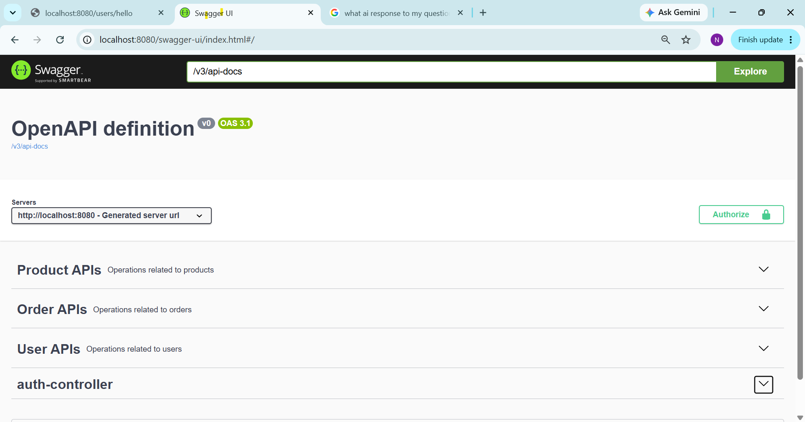
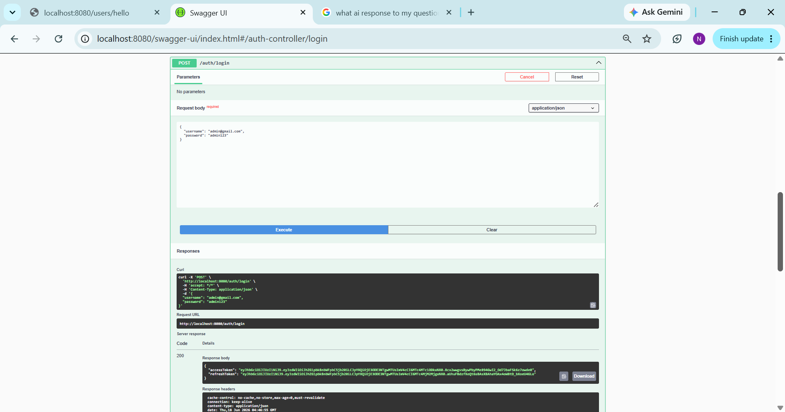
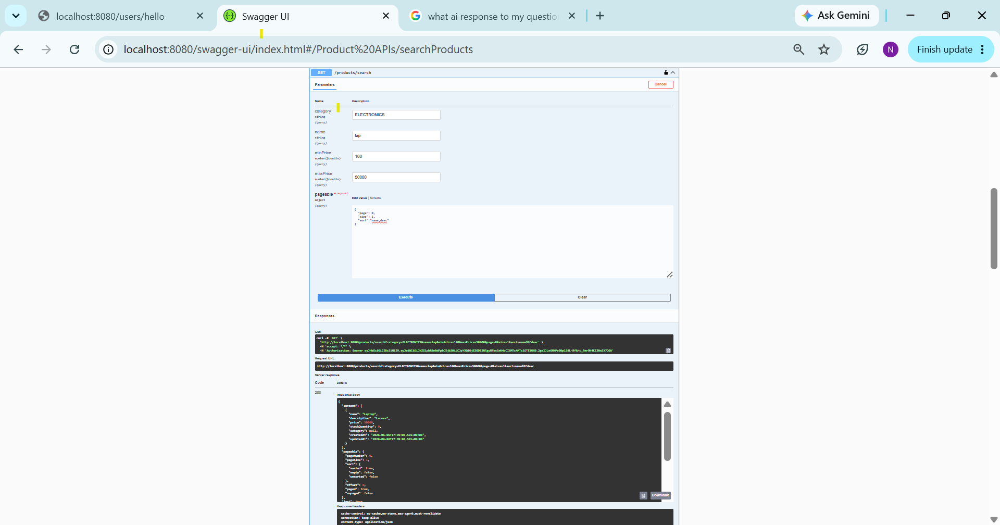
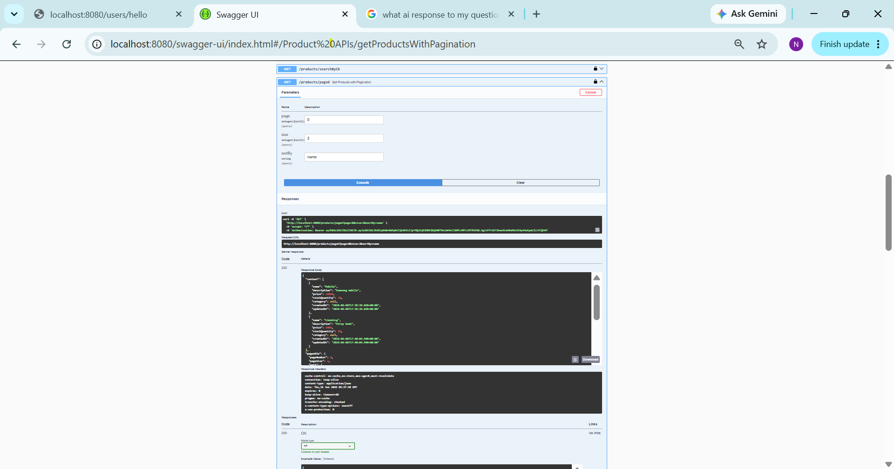
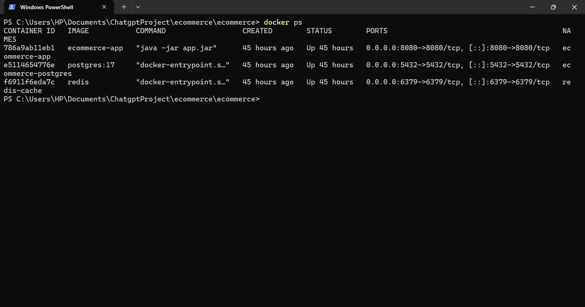

# Ecommerce Backend Application

A production-style E-Commerce Backend application built using Spring Boot.

The project provides secure JWT-based authentication, user management, product management, order management, caching with Redis, database versioning using Flyway, dynamic searching using Specifications and Criteria API, automated testing, and Docker-based deployment.

---

## Tech Stack

### Backend

* Java 21
* Spring Boot 3.5
* Spring Security
* Spring Data JPA
* Hibernate

### Database

* PostgreSQL
* Flyway Migration

### Caching

* Redis

### API Documentation

* Swagger / OpenAPI

### Testing

* JUnit 5
* Mockito
* MockMvc
* Integration Testing

### Deployment

* Docker
* Docker Compose

---
## Running with Docker

docker compose up -d

## Features

- JWT Authentication & Refresh Tokens
- Role Based Authorization
- Product Management
- Order Management
- Dynamic Search using Specifications
- Criteria API Queries
- Pagination & Sorting
- Redis Caching
- Flyway Migrations
- Docker & Docker Compose
- Unit Testing (Mockito)
- Integration Testing (MockMvc + Testcontainers)

### Authentication

* JWT Authentication
* Refresh Token Support
* Role Based Authorization

### User Management

* Create User
* Update User
* Delete User
* Search Users
* Pagination Support
* Get Current Logged-in User

### Product Management

* Create Product
* Update Product
* Delete Product
* Search Products
* Pagination Support
* Dynamic Filtering using Specifications
* Dynamic Filtering using Criteria API

### Order Management

* Place Orders
* View Order Details
* View My Orders
* Admin View of All Orders

### Infrastructure

* Redis Cache
* Flyway Database Migration
* Dockerized Deployment

---

## Running Locally

```bash
mvn clean install
mvn spring-boot:run
```

---

## Running Using Docker Compose

```bash
docker compose up -d
```

---

## API Documentation

Swagger UI:

http://localhost:8080/swagger-ui/index.html

---

## Testing

Run all tests:

```bash
mvn test
```

---

## Project Structure

Controller
↓
Service
↓
Repository
↓
PostgreSQL

Additional Components:

* JWT Security
* Redis Cache
* Flyway Migration
* Docker Containers


## Swagger UI Overview

Swagger UI of all API's with Authorize option



## Authentication

JWT Login API



## Product Search

Dynamic filtering using Specifications



## Product Pagination

Dynamic fetching using pageable 



## Docker Containers

Application running with Docker Compose


